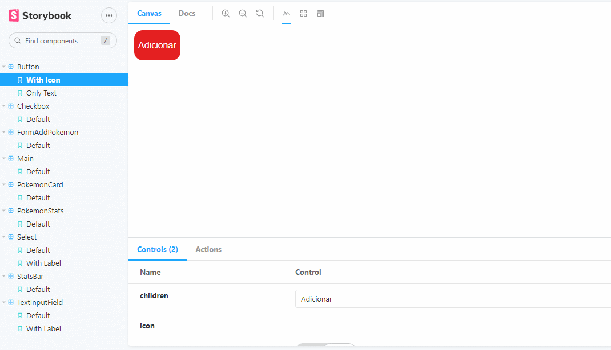
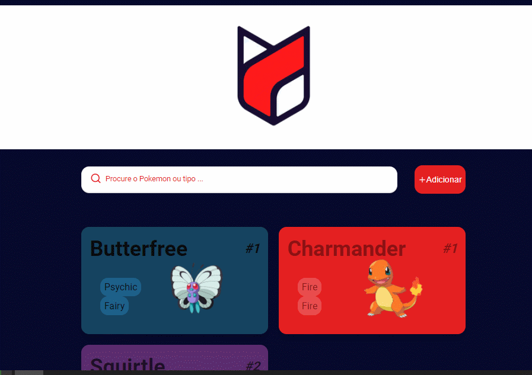
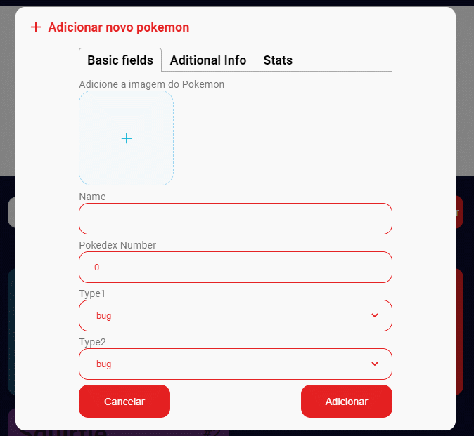
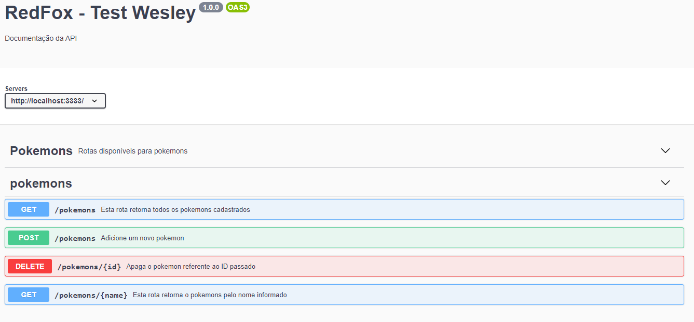

# 👨‍💻 Wesley Moreira Oliveira

   

### Leiam por favor.

Os ajustes informados anteriormente foram devidamente feitos. Muito obrigado pela compreensão.

# - Frontend -

## Abordagem

Comecei criando um mock com os dados necessários e usei o mocky.io junto com o storybook para fazer o Frontend.
Procurei desenvolver os componentes de forma mais isolada possível, permitindo a sua reutilização ampla.

## Instruções

- Instale as dependências `$ yarn`
- Navegue até a pasta /frontend e execute - `$ yarn dev`
- Para visualizar o protótipo isolado de cada componente e suas diferentes propriedades, utilize o comando: `$ yarn storybook`

### O que foi utilizado?

- Typescript
- Styled Components
- NextJS
- Joi
- Plop - `$ yarn generate ComponentName` (automatizar a criação dos components)
- Storybook - O Storybook é uma excelente ferramenta para prototipação da UI e visualização isolada da aplicação.

- [x] Joi - Validation
      

- [x] Typescript
- [x] NextJs
- [x] Styled Components

## Importante

- [x] Utilizei o NextJs com recursos de criação dinâmica de páginas estáticas para as rotas /pokemon/nomedopokemon. Ou seja a aplicação tem uma página estática para cada pokemon do banco de dados.

---

# - Backend -

## Instruções

- Por favor certifique-se que tem o MongoDB Instalado.
  - inicie o serviço do Mongo - `$ mongod`
- Navegue até a pasta /backend e execute - `$ yarn dev`

- Para visualizar a documentação da API, visite a rota: `/api-docs/`. Exemplo : `http://localhost:3333/api-docs/`

### O que foi utilizado?

- Typescript
- Nodemon
- Cors
- Multer
- MongoDB
- Mongoose
- Express
- Swagger

## Rotas disponíveis

- [x] GET - http://localhost:3333/pokemons
- [x] GET - http://localhost:3333/pokemons/{pokemonname}
- [x] DELETE - http://localhost:3333/pokemons/{id}
- [x] POST - http://localhost:3333/pokemons/ (passando JSON no corpo da requisição)
      Extra:
- [x] GET - http://localhost:3333/api-docs

### Por favor, fiquem a vontade para críticas e feedbacks de melhoria. Eu ficaria muito feliz em saber como progredir.
