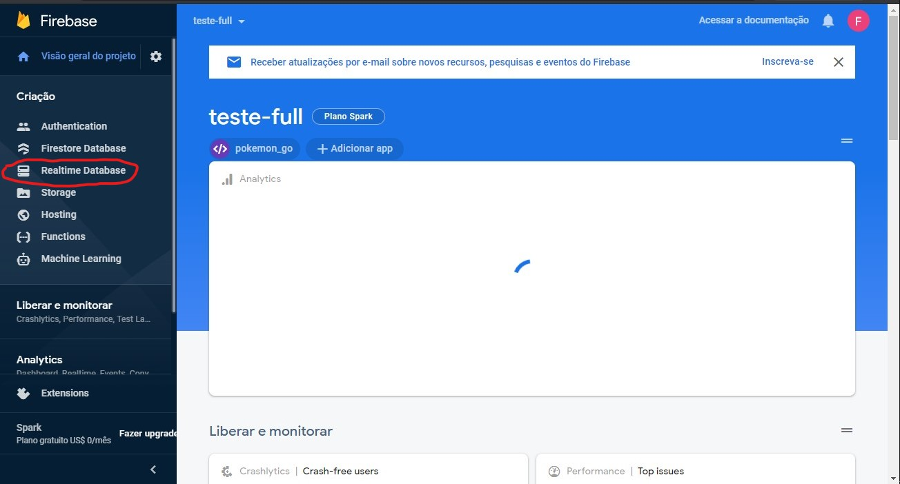

<h1 align="center"> Backend - Pokémon Go  </h1>

<h2> Tecnologias usadas:  </h2>

- NodeJS
- Express
- Babel
- ES6
- Firebase

<h2> Primeiros Passos </h2>

 Antes de tudo, precisamos acessar o banco de dados do firebase.  

 Para fazer isso, acesse https://firebase.google.com/ 

 Faça o login com as seguintes informações: 

- Email: teste.andreiamaral@gmail.com
- Senha: fullteste

 Clique em "Ir para o console" ao lado do iconde de perfil.
     
    

 Após carregado, clique no projeto nomeaado 'teste-full'. 

 Após o projeto ser carregado, basta clicar na opção "Realtime database" no menu ao lado esquerdo. 

 É aqui que iremos armazenar as informações vindas do excel.

<h2> Tudo certo! </h2>

 Agora que vimos onde fica nosso banco de dados, estamos prontos para partir para o backend! .

<h2> Estrutura de pastas. </h2>

 Tudo que nos precisamos observar esta dentro da pasta src. 

<h2> Do Excel para o Firebase </h2>

 A pasta config é onde nos fazemos as configurações de migração do excel para o firebase. 

 É bem simples, dentro do arquivo excel_to_database.js, nos pegamos os campos e valores do excel e jogamos dentro da variavel 'excelData'. 

 A estrutura da varival excelData é um objeto que contem as Sheets do excel. Cada Sheet retorna um array com suas chaves e valores 

 Como nosso excel só tem uma Sheet, pegamos essa Sheet e percorremos ela para podermos ter acesso a cada objeto (pokémon).

    E então, no banco de dados, indicamos que queremos acessar a coluna '/Pokemons' e criar um novo objeto passando a propiedade Row como chave de identificação, esse objeto ira conter todas as informações sobre o pokémon.

<h2> Bora mandar os pokémons para o banco de dados!</h2>

 Agora que vimos como funcionará essa transição, basta inciarmos um terminal na pasta backend e rodarmos o comando 'npm run dev'. 

 Agora basta voltarmos para o banco de dados no site do firebase e vermos nossos pokemons listados conforme seu id (propiedade Row).

<h2> Controle dos pokémons </h2>

 No arquivo pokemons.js dentro de src/controllers é onde nos setamos os metodos como: 

- listagem de pokemon (index)
- novo pokémon (createPokemon)
- atualizar pokémon (updatePokemon)
- receber detalhes de um pokémon (getPokemonData)
- deletar pokémon (deletePokemon)

<h2> Pronto! </h2>

 O restante esta simples de se entender, agora basta partimos para o frontend da nossa aplicação! 
